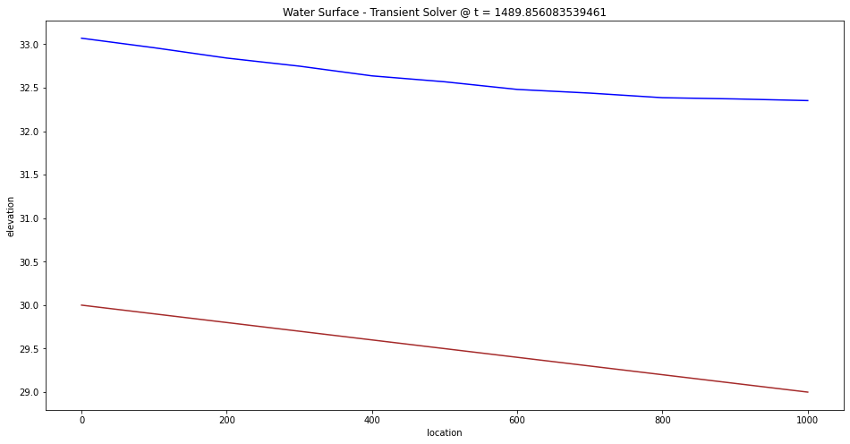

# CE 5362 Lesson 9 Unsteady Open Channel Flow
---

Refining the Lax-Scheme to generalize and explore some different examples.

## Finite-Difference Method for Unsteady Open Channel Flow

 The simplest form of solution that is conditionally stable and reasonably straightforward to program is called the Lax-Diffusion scheme.  Recall our difference equations derived from continunity:

\begin{equation}
\begin{matrix}
y_i^{t+\Delta t} = \frac{1}{2}(y_{i-1}^t+y_{i+1}^t) -\frac{r}{2}(\frac{A}{B}\vert_{i-1}^t + \frac{A}{B}\vert_{i+1}^t)(V_{i+1}^{t}-V_{i-1}^t)-\frac{r}{2}(V_{f,i-1}^t + V_{f,i+1}^t)(y_{i+1}^{t}-y_{i-1}^t) \\
~\\
 \end{matrix}
 \label{eqn:lax-continunity}
\end{equation}


and momentum:

\begin{equation}
\begin{matrix}
V_i^{t+\Delta t}=\frac{1}{2}(V_{i-1}^t+V_{i+1}^t) +
\Delta t  g(S_0-\frac{1}{2}(S_{f,i-1}^t + S_{f,i+1}^t))
- \frac{r}{2}(V_{i-1}^t+V_{i+1}^t) (V_{i+1}^{t}-V_{i-1}^t)
-rg(y_{i+1}^{t}-y_{i-1}^t)\\
~\\
\end{matrix}
\label{eqn:lax-momentum}
\end{equation}

### Example Non-Prismatic Channel - Still a Steady Flow Case
A plan view of a rectangular channel of variable width as shown in Figure 1


|Figure 1. Non-Prismatic Rectangular Channel|
|---|

The channel conveys $Q=100~m^3/sec$, with a bottom slope of $0.001$ and average Manning's $n$ value of $0.033$.  A backwater curve is caused by a weir at the downstream end (to the right in the figure) by a 7 meter tall weir.
Flow depth over the weir is at critical depth $h_c = 2.17$ meters.  Normal flow in the upstream portion for 10-meter channel width is $h_n = 5.6$ meters.  Using the unsteady solver, run the solver until an equilibrium solution is returned and compare the result to either the same case in the fixed-step steady flow solver, or SWMM.

As with our prior example, we will just modify our script a bit to handle the changing geometry. In this example we will place the script into three sub-blocks to facilitate changes and re-running after those changes.


```python
import math # python package for various common math functions
import matplotlib # python plotting package

########## prototype hydraulic functions #####################
# hydraulic functions for trapezoidal channels
# depth == flow depth          
# bottom == bottom width of trapezoidal channel
# side == side slope (same value both sides) of trapezoidal channel
# computed values:
# bt == computed topwidth :: ar == flow area, used in fd update :: wp == wetted perimeter, used in fd update

def bt(depth,bottom,side):   # depth-topwidth function
    topwidth = (bottom + 2.0*side*depth);
    return(topwidth);

def ar(depth,bottom,side):  # depth area function
    area = (depth*(bottom+side*depth));
    return(area)

def wp(depth,bottom,side):   # depth perimeter
    import math
    perimeter = (bottom+2.0*depth*math.sqrt(1.0+side*side));
    return(perimeter)

######### prototype display functions #########################

def writenow(t,dt,y,v,b0,s): # printing functions
    print("__________")
    print("Time = ",t," seconds.","Time step length = ",dt," seconds ")
    print("IROW "," DEPTH "," VELOCITY ")
    for irow in range(0,len(v)):
        print(irow,round(y[irow],3),round(v[irow],3))
    return()  #observe a NULL return, this function messages to the output device, so there is nothing to return.

def plot2lines(list1,list2,list3,list4,strx,stry,strtitle): # plot list1 on x, list2 on y, xlabel, ylabel, title
    from matplotlib import pyplot as plt # import the plotting library from matplotlibplt.show()
    myfigure = matplotlib.pyplot.figure(figsize = (16,8))
    plt.plot( list1, list2, color ='brown', marker ='', linestyle ='solid') # create a line chart, years on x-axis, gdp on y-axis
    plt.plot( list3, list4, color ='blue', marker ='', linestyle ='solid') # create a line chart, years on x-axis, gdp on y-axis
    plt.title(strtitle)# add a title
    plt.ylabel(stry)# add a label to the x and y-axes
    plt.xlabel(strx)
    plt.show() # display the plot
    return #null return
```

Our problem constants are modified in this instance as in the fragment below, this block is mostly input conditions and some prerptory calculations before the hydraulics model -- observe how we have added vecotrs for geometry in this case.


```python
###### Problem Constants and Input Block #######
# simulation domain
l = 30000.0 # total length (the length of computational domain)
n = 30 # number of reaches
# physical constants
g = 9.81 # gravitational acceleration, obviously SI units

q0 = 100.0 # initial discharge
yd = 9.17 # initial flow depth in the model
yu = 5.60 # upstream constant depth
mn = 0.033 # Manning's n
s0 = 0.001 # longitudinal slope (along direction of flow)

tmax = 86000 # total simulation time in seconds (one day in this case)
iprt =  1000 # print every iprt time steps (make big to suppress output)
nn = n+1 # how many nodes, will jack with boundaries later
mn2 = mn*mn # Manning's n squared, will appear a lot.
######## Here we build storage vectors ###############
bw = [0]*nn # bottom width vector 
ss = [0]*nn # side slope vector
#### Geometry
bw = [10,10,10,10,10,10,10,10,10,10,10,10,9,8,7,9,8,7,8,9,10,11,12,13,14,13,12,11,10,10,10]
ss = [0,0,0,0,0,0,0,0,0,0,0,0,0,0,0,0,0,0,0,0,0,0,0,0,0,0,0,0,0,0,0]
#### Initial Velocity 
a = ar(yd,bw[n],ss[n]) # flow area at beginning of time
v0 = q0/a # initial velocity
#### depth and velocity vectors
y = [0]*nn # create nn elements of vector y, all zero
yp = [0]*nn # updates go in this vector, same length as y
v = [0]*nn # create nn elements of vector v
vp = [0]*nn # updates go in this vector, same length and v
ytmp = [0]*nn
vtmp = [0]*nn
y = [float(yd) for i in y] # populate y with nn things, each thing has value yd
v = [float(v0) for i in y] # populate v with nn things, each thing has value v0
### Build the output geometry
b = bt(y[n],bw[n],ss[n]) # topwidth at downstream end
c = math.sqrt(g*a/b) # celerity at initial conditions
dx = l/n # delta x, length of a reach
xx = [dx*(i) for i in range(0,nn)] # Spatial locations of nodes, used for plotting
bse = [30 - s0*xx[i] for i in range(0,nn)] # bottom channel elevation
wse = [bse[i]+y[i] for i in range(0,nn)] # water surface elevation
dt = dx/(v0 + c) # the time step that satisfies the courant condtions
kmax = round(tmax/dt)  # set maximum number of time steps
print('Celerity = ',round(c,3) )
print('Delta x  = ',round(dx,3))
print('Delta t  = ',round(dt,3))
print("ITmax = ",(kmax))
```

    Celerity =  9.485
    Delta x  =  1000.0
    Delta t  =  94.562
    ITmax =  909


```python
k = 0 # time counter
t = 0.0 # elapsed time
writenow(t,dt,y,v,bw[0],ss[0]) #print the start conditions
for itime in range(0,kmax): # begin time stepping loop scope
#print('Iteration Count = ',itime)
######## Adaptive Time Step Based on Current mesh courant number ###
    bestdt = dt # start with current time step
### begin courant number each cell loop scope
    for i in range(0,nn):
        a = ar(y[i],bw[i],ss[i]);
        b = bt(y[i],bw[i],ss[i]);
        c = math.sqrt(g*a/b);
        dtn = dx/abs((v[i])+c)
    # now test
        if(dtn < bestdt):
            bestdt = dtn
### end courant number each cell loop scope
    dt = bestdt
#print('time-step length = ',dt)
#writenow(t,dt,y,v,b0,s)


###### Finite Difference #################################
    r = 0.5*dt/dx;
###### LEFT BOUNDARY #####################################
# UPSTREAM FIXED STAGE AT PRESCRIBED NORMAL DEPTH        #
##########################################################
    yp[0] = yu
    ab = ar(y[1],bw[1],ss[1]);
    bb = bt(y[1],bw[1],ss[1]);
    cb = math.sqrt(g*bb/ab);
    rb = ab/wp(y[1],bw[1],ss[1]);
    sfb = (mn2*v[1]*v[1])/(rb**(1.333));
    cn = v[1] -cb*y[1]+ g*(s0-sfb)*dt;
    vp[0] = cn + cb*yp[0];
###### RIGHT BOUNDARY ####################################
#         FIXED STAGE AT DOWNSTREAM END                  #
##########################################################
# reflection boundary, find velocity along a characteristic
    yp[n-1] = yd ;
    aa = ar(y[n-1],bw[n-1],ss[n-1]);
    ba = bt(y[n-1],bw[n-1],ss[n-1]);
    ca = math.sqrt(g*ba/aa);
    ra = aa/wp(y[n-1],bw[n-1],ss[n-1]);
    sfa = (mn2*v[n-1]*v[n-1])/(ra**(4.0/3.0));
    cp = v[n-1] + ca*y[n-1]+g*(s0-sfa)*dt;
##yp[nn] <<- (cp - vp[nn])/ca;
    vp[n] = cp - yp[n]*ca 
######## INTERIOR NODES AND REACHES ###############
### loop through the interior nodes
    for i in range(1,n): # begin interior node loop scope
        aa = ar(y[i-1],bw[i-1],ss[i-1]);
        ba = bt(y[i-1],bw[i-1],ss[i-1]);
        pa = wp(y[i-1],bw[i-1],ss[i-1]);
        ra = aa/pa;
        sfa = (mn2*v[i-1]*v[i-1])/(ra**(4.0/3.0));
        ab = ar(y[i+1],bw[i+1],ss[i+1]);
        bb = bt(y[i+1],bw[i+1],ss[i+1]);
        pb = wp(y[i+1],bw[i+1],ss[i+1]);
        rb = ab/pb;
        sfb = (mn2*v[i+1]*v[i+1])/(rb**(4.0/3.0));
# need averages of sf, hydraulic depth
        dm = 0.5*(aa/ba + ab/bb);
        sfm = 0.5*(sfa+sfb);
        vm = 0.5*(v[i-1]+v[i+1]);
        ym = 0.5*(y[i-1]+y[i+1]);
# new momentum
        vp[i] = vm -r*g*(y[i+1] - y[i-1]) -r*vm*(v[i+1] - v[i-1]) + g*dt*(s0-sfm);
# new depth
        yp[i] = ym - r*dm*(v[i+1] - v[i-1]) -r*vm*(y[i+1] - y[i-1]);
### end of interior node loop scope
# update time, count, depth and momentum
    t = t+dt; # Increment simulation time
    k = k+1; # Increment loop counter
    for i in range(0,n):
        v[i]=vp[i]
        y[i]=yp[i]
    if (k%iprt == 0): # Write current conditions every iprt time steps
        writenow(t,dt,y,v,b0,s)
    dt = 2*dt #artificially inflate the time step to force adaptive update
# end time step loop

# provisional code to make a plot
writenow(t,dt,y,v,bw[0],ss[0])
for i in range(0,nn):
    wse[i]=bse[i]+y[i]
plot2lines(xx,bse,xx,wse,"location","elevation","Water Surface using Equilibrium Solution - Transient Solver")
```

    __________
    Time =  0.0  seconds. Time step length =  94.56161179137669  seconds 
    IROW   DEPTH   VELOCITY 
    0 9.17 1.091
    1 9.17 1.091
    2 9.17 1.091
    3 9.17 1.091
    4 9.17 1.091
    5 9.17 1.091
    6 9.17 1.091
    7 9.17 1.091
    8 9.17 1.091
    9 9.17 1.091
    10 9.17 1.091
    11 9.17 1.091
    12 9.17 1.091
    13 9.17 1.091
    14 9.17 1.091
    15 9.17 1.091
    16 9.17 1.091
    17 9.17 1.091
    18 9.17 1.091
    19 9.17 1.091
    20 9.17 1.091
    21 9.17 1.091
    22 9.17 1.091
    23 9.17 1.091
    24 9.17 1.091
    25 9.17 1.091
    26 9.17 1.091
    27 9.17 1.091
    28 9.17 1.091
    29 9.17 1.091
    30 9.17 1.091
    __________
    Time =  83063.06950202376  seconds. Time step length =  184.4376617037278  seconds 
    IROW   DEPTH   VELOCITY 
    0 5.6 1.824
    1 5.606 1.825
    2 5.614 1.824
    3 5.625 1.823
    4 5.638 1.822
    5 5.655 1.82
    6 5.675 1.818
    7 5.702 1.815
    8 5.734 1.812
    9 5.775 1.806
    10 5.827 1.805
    11 5.882 1.778
    12 5.932 1.764
    13 5.944 1.69
    14 5.952 1.751
    15 5.952 1.673
    16 5.924 1.71
    17 5.918 1.721
    18 5.904 1.701
    19 5.906 1.754
    20 5.961 1.782
    21 6.068 1.799
    22 6.233 1.805
    23 6.463 1.799
    24 6.755 1.764
    25 7.102 1.722
    26 7.494 1.656
    27 7.918 1.587
    28 8.369 1.519
    29 8.895 1.503
    30 9.17 1.091


```python
# copy from lesson 6
depth_steady_solver = [9.17,8.459000000000003,7.813,7.206000000000003,6.584,5.969,5.379000000000002,4.889,4.665,4.701,4.931999999999999,5.306000000000003,5.810000000000002,6.467000000000001,6.9,6.819000000000002,6.532,6.202000000000002,5.960000000000001,5.791999999999998,5.681999999999999,5.612,5.568000000000001,5.5409999999999995,5.525000000000001,5.5150000000000015,5.509000000000003,5.506000000000002,5.504000000000001,5.502000000000001,  5.502000000000001]
depth_unsteady_solver = [0]*nn
for i in range(n,-1,-1):
    depth_unsteady_solver[i] = y[n-i]
difference = []
for i in range(len(y)):
    difference.append(100*(depth_steady_solver[i]-depth_unsteady_solver[i])/depth_steady_solver[i])
```


```python
plot2lines(xx,depth_steady_solver,xx,depth_unsteady_solver,"Position","Depth","Flow Depth by Unsteady and Steady Solver")
```


```python
plot2lines(xx,difference,xx,difference,"Position","% Difference","Flow Depth by Unsteady and Steady Solver")
```


## Example Transient Flow in Sudden Channel Closure
Now lets modify our script to consider the following example problem:
- Flow in a 1000-m long trapezoidal channel with a bottom width of 20-m, side slopeof 2H:1V, 
- Longitudinal slope $S_0$=0.0001,
- Manning’s resistance n=0.013.  
- Initial discharge in the channel is 110 $\frac{m^3}{s}$ 
- Initial flow depth is 3.069 m.  

Simulate theflow  and  depth  at  every  100-m  station  when  a  downstream  gate  is  closed  at  t=0.

Produce a graph of depth and velocity versus location for t=0, 60, 360 seconds.

This example is derived from Hydraulic Engineering Roberson, J. A., Cassidy, J.J.,and Chaudry, M. H., (1988) Hydraulic Engineering, Houghton Mifflin Co.  It is iden-tical to the example in that book starting on page 623. (Chapter 12 on the server copy)


```python
###### Problem Constants and Input Block #######
# simulation domain
l = 1000.0 # total length (the length of computational domain)
n = 10 # number of reaches
# physical constants
g = 9.81 # gravitational acceleration, obviously SI units

q0 = 110.0 # initial discharge
yd = 3.069 # initial flow depth in the model
yu = 3.069 # upstream constant depth
mn = 0.013 # Manning's n
s0 = 0.001 # longitudinal slope (along direction of flow)

tmax = 6000 # total simulation time in seconds (one day in this case)
iprt =  10 # print every iprt time steps (make big to suppress output)
nn = n+1 # how many nodes, will jack with boundaries later
mn2 = mn*mn # Manning's n squared, will appear a lot.
######## Here we build storage vectors ###############
bw = [0]*nn # bottom width vector 
ss = [0]*nn # side slope vector
#### Geometry
bw = [20,20,20,20,20,20,20,20,20,20,20]
ss = [2,2,2,2,2,2,2,2,2,2,2]
#### Initial Velocity 
a = ar(yd,bw[n],ss[n]) # flow area at beginning of time
v0 = q0/a # initial velocity
#### depth and velocity vectors
y = [0]*nn # create nn elements of vector y, all zero
yp = [0]*nn # updates go in this vector, same length as y
v = [0]*nn # create nn elements of vector v
vp = [0]*nn # updates go in this vector, same length and v
ytmp = [0]*nn
vtmp = [0]*nn
y = [float(yd) for i in y] # populate y with nn things, each thing has value yd
v = [float(v0) for i in y] # populate v with nn things, each thing has value v0
### Build the output geometry
b = bt(y[n],bw[n],ss[n]) # topwidth at downstream end
c = math.sqrt(g*a/b) # celerity at initial conditions
dx = l/n # delta x, length of a reach
xx = [dx*(i) for i in range(0,nn)] # Spatial locations of nodes, used for plotting
bse = [30 - s0*xx[i] for i in range(0,nn)] # bottom channel elevation
wse = [bse[i]+y[i] for i in range(0,nn)] # water surface elevation
dt = dx/(v0 + c) # the time step that satisfies the courant condtions
kmax = round(tmax/dt)  # set maximum number of time steps
print('Celerity = ',round(c,3) )
print('Delta x  = ',round(dx,3))
print('Delta t  = ',round(dt,3))
print("ITmax = ",(kmax))
```

    Celerity =  4.938
    Delta x  =  100.0
    Delta t  =  15.85
    ITmax =  379


```python
k = 0 # time counter
t = 0.0 # elapsed time
writenow(t,dt,y,v,bw[0],ss[0])
for i in range(0,nn):
    wse[i]=bse[i]+y[i]
plot2lines(xx,bse,xx,wse,"location","elevation","Water Surface - Transient Solver @ t = "+str(t))

for itime in range(0,kmax): # begin time stepping loop scope
#print('Iteration Count = ',itime)
######## Adaptive Time Step Based on Current mesh courant number ###
    bestdt = dt # start with current time step
### begin courant number each cell loop scope
    for i in range(0,nn):
        a = ar(y[i],bw[i],ss[i]);
        b = bt(y[i],bw[i],ss[i]);
        c = math.sqrt(g*a/b);
        dtn = dx/abs((v[i])+c)
    # now test
        if(dtn < bestdt):
            bestdt = dtn
### end courant number each cell loop scope
    dt = bestdt
#print('time-step length = ',dt)
#writenow(t,dt,y,v,b0,s)

    #print(v[n],vp[n])
###### Finite Difference #################################
    r = 0.5*dt/dx;
###### LEFT BOUNDARY #####################################
# UPSTREAM FIXED STAGE AT PRESCRIBED NORMAL DEPTH        #
##########################################################
    yp[0] = yu
    ab = ar(y[1],bw[1],ss[1]);
    bb = bt(y[1],bw[1],ss[1]);
    cb = math.sqrt(g*bb/ab);
    rb = ab/wp(y[1],bw[1],ss[1]);
    sfb = (mn2*v[1]*v[1])/(rb**(1.333));
    cn = v[1] -cb*y[1]+ g*(s0-sfb)*dt;
    vp[0] = cn + cb*yp[0];
###### RIGHT BOUNDARY ####################################
#         FIXED STAGE AT DOWNSTREAM END                  #
##########################################################
# fixed stage boundary, find velocity along a characteristic
#    yp[n-1] = yd ;
#    aa = ar(y[n-1],bw[n-1],ss[n-1]);
#    ba = bt(y[n-1],bw[n-1],ss[n-1]);
#    ca = math.sqrt(g*ba/aa);
#    ra = aa/wp(y[n-1],bw[n-1],ss[n-1]);
#    sfa = (mn2*v[n-1]*v[n-1])/(ra**(4.0/3.0));
#    cp = v[n-1] + ca*y[n-1]+g*(s0-sfa)*dt;
##yp[nn] <<- (cp - vp[nn])/ca;
#    vp[n] = cp - yp[n]*ca 

###### RIGHT BOUNDARY ####################################
# REFLECTION BOUNDARY AT DOWNSTREAM END                  #
##########################################################
# reflection boundary, find depth along a characteristic
    vp[n] = 0. ;
    aa = ar(y[n-1],bw[n-1],ss[n-1]);
    ba = bt(y[n-1],bw[n-1],ss[n-1]);
    ca = math.sqrt(g*ba/aa);
    ra = aa/wp(y[n-1],bw[n-1],ss[n-1]);
    sfa = (mn2*v[n-1]*v[n-1])/(ra**(4.0/3.0));
    cp = v[n-1] + ca*y[n-1]+g*(s0-sfa)*dt;
    yp[n] = (cp - vp[n])/ca;
######## INTERIOR NODES AND REACHES ###############
### loop through the interior nodes
    for i in range(1,n): # begin interior node loop scope
        aa = ar(y[i-1],bw[i-1],ss[i-1]);
        ba = bt(y[i-1],bw[i-1],ss[i-1]);
        pa = wp(y[i-1],bw[i-1],ss[i-1]);
        ra = aa/pa;
        sfa = (mn2*v[i-1]*v[i-1])/(ra**(4.0/3.0));
        ab = ar(y[i+1],bw[i+1],ss[i+1]);
        bb = bt(y[i+1],bw[i+1],ss[i+1]);
        pb = wp(y[i+1],bw[i+1],ss[i+1]);
        rb = ab/pb;
        sfb = (mn2*v[i+1]*v[i+1])/(rb**(4.0/3.0));
# need averages of sf, hydraulic depth
        dm = 0.5*(aa/ba + ab/bb);
        sfm = 0.5*(sfa+sfb);
        vm = 0.5*(v[i-1]+v[i+1]);
        ym = 0.5*(y[i-1]+y[i+1]);
# new momentum
        vp[i] = vm -r*g*(y[i+1] - y[i-1]) -r*vm*(v[i+1] - v[i-1]) + g*dt*(s0-sfm);
# new depth
        yp[i] = ym - r*dm*(v[i+1] - v[i-1]) -r*vm*(y[i+1] - y[i-1]);
### end of interior node loop scope
# update time, count, depth and momentum
    t = t+dt; # Increment simulation time
    k = k+1; # Increment loop counter
    for i in range(0,n+1):
        v[i]=vp[i]
        y[i]=yp[i]
    if (k%iprt == 0): # Write current conditions every iprt time steps
        writenow(t,dt,y,v,bw[0],ss[0])
        for i in range(0,nn):
            wse[i]=bse[i]+y[i]
        plot2lines(xx,bse,xx,wse,"location","elevation","Water Surface - Transient Solver @ t = "+str(t))
    dt = 2*dt #artificially inflate the time step to force adaptive update
    #print(v[n],vp[n])
# end time step loop

# provisional code to make a plot
writenow(t,dt,y,v,bw[0],ss[0])
for i in range(0,nn):
    wse[i]=bse[i]+y[i]
plot2lines(xx,bse,xx,wse,"location","elevation","Water Surface - Transient Solver @ t = "+str(t))
```

    __________
    Time =  0.0  seconds. Time step length =  15.850313562235069  seconds 
    IROW   DEPTH   VELOCITY 
    0 3.069 1.371
    1 3.069 1.371
    2 3.069 1.371
    3 3.069 1.371
    4 3.069 1.371
    5 3.069 1.371
    6 3.069 1.371
    7 3.069 1.371
    8 3.069 1.371
    9 3.069 1.371
    10 3.069 1.371


    __________
    Time =  145.95316854116936  seconds. Time step length =  13.584294913208971  seconds 
    IROW   DEPTH   VELOCITY 
    0 3.069 2.515
    1 3.12 2.417
    2 3.143 2.373
    3 3.362 1.967
    4 3.463 1.783
    5 3.801 1.193
    6 3.952 0.934
    7 4.185 0.561
    8 4.31 0.357
    9 4.444 0.163
    10 4.543 0.0


    __________
    Time =  289.0017788582659  seconds. Time step length =  15.906750641818078  seconds 
    IROW   DEPTH   VELOCITY 
    0 3.069 0.578
    1 3.335 0.323
    2 3.653 0.48
    3 3.897 0.208
    4 4.201 0.332
    5 4.372 0.165
    6 4.634 0.267
    7 4.772 0.134
    8 4.982 0.176
    9 5.103 0.052
    10 5.241 0.0


    __________
    Time =  453.58168383936817  seconds. Time step length =  17.16322066707801  seconds 
    IROW   DEPTH   VELOCITY 
    0 3.069 -2.435
    1 3.269 -2.217
    2 3.498 -1.972
    3 3.584 -1.64
    4 3.807 -1.431
    5 3.856 -1.118
    6 4.078 -0.919
    7 4.101 -0.641
    8 4.321 -0.443
    9 4.322 -0.204
    10 4.533 0.0


    __________
    Time =  636.2098560016675  seconds. Time step length =  19.354183236636196  seconds 
    IROW   DEPTH   VELOCITY 
    0 3.069 -0.925
    1 3.034 -0.748
    2 2.987 -0.945
    3 2.988 -0.754
    4 2.966 -0.883
    5 2.997 -0.671
    6 3.032 -0.679
    7 3.083 -0.463
    8 3.172 -0.363
    9 3.231 -0.161
    10 3.355 0.0


    __________
    Time =  822.0848381854387  seconds. Time step length =  16.416837156885304  seconds 
    IROW   DEPTH   VELOCITY 
    0 3.069 1.232
    1 3.075 1.292
    2 3.073 1.212
    3 3.103 1.225
    4 3.101 1.123
    5 3.176 1.053
    6 3.172 0.91
    7 3.31 0.732
    8 3.3 0.524
    9 3.496 0.261
    10 3.485 0.0


    __________
    Time =  973.5163609105314  seconds. Time step length =  14.711011904766925  seconds 
    IROW   DEPTH   VELOCITY 
    0 3.069 1.777
    1 3.175 1.63
    2 3.292 1.649
    3 3.496 1.336
    4 3.627 1.247
    5 3.862 0.906
    6 3.985 0.767
    7 4.191 0.5
    8 4.286 0.35
    9 4.453 0.157
    10 4.517 0.0


    __________
    Time =  1132.2896642659598  seconds. Time step length =  16.644050831997376  seconds 
    IROW   DEPTH   VELOCITY 
    0 3.069 -0.211
    1 3.322 -0.37
    2 3.587 -0.181
    3 3.797 -0.319
    4 4.036 -0.166
    5 4.184 -0.243
    6 4.398 -0.12
    7 4.502 -0.149
    8 4.692 -0.061
    9 4.759 -0.049
    10 4.922 0.0


    __________
    Time =  1302.8601992567947  seconds. Time step length =  17.748238128311964  seconds 
    IROW   DEPTH   VELOCITY 
    0 3.069 -1.827
    1 3.15 -1.633
    2 3.273 -1.573
    3 3.34 -1.332
    4 3.505 -1.198
    5 3.559 -0.958
    6 3.742 -0.792
    7 3.78 -0.568
    8 3.967 -0.388
    9 3.989 -0.183
    10 4.172 0.0


    __________
    Time =  1489.856083539461  seconds. Time step length =  19.42224717020827  seconds 
    IROW   DEPTH   VELOCITY 
    0 3.069 -0.243
    1 3.06 -0.097
    2 3.041 -0.256
    3 3.048 -0.114
    4 3.036 -0.256
    5 3.068 -0.116
    6 3.08 -0.209
    7 3.138 -0.088
    8 3.185 -0.115
    9 3.271 -0.031
    10 3.352 0.0





    __________
    Time =  1667.7237224161013  seconds. Time step length =  16.142787698963232  seconds 
    IROW   DEPTH   VELOCITY 
    0 3.069 1.292
    1 3.111 1.307
    2 3.149 1.248
    3 3.233 1.19
    4 3.268 1.093
    5 3.398 0.958
    6 3.431 0.821
    7 3.604 0.617
    8 3.633 0.437
    9 3.829 0.208
    10 3.847 0.0


    __________
    Time =  1824.6781719768726  seconds. Time step length =  15.957460787558558  seconds 
    IROW   DEPTH   VELOCITY 
    0 3.069 1.14
    1 3.224 0.955
    2 3.393 1.014
    3 3.611 0.721
    4 3.773 0.707
    5 3.976 0.459
    6 4.112 0.419
    7 4.28 0.247
    8 4.389 0.191
    9 4.527 0.079
    10 4.613 0.0


    __________
    Time =  1992.6734616396911  seconds. Time step length =  17.04423075370578  seconds 
    IROW   DEPTH   VELOCITY 
    0 3.069 -0.95
    1 3.259 -0.969
    2 3.469 -0.784
    3 3.616 -0.762
    4 3.831 -0.58
    5 3.94 -0.533
    6 4.147 -0.374
    7 4.222 -0.309
    8 4.415 -0.18
    9 4.46 -0.099
    10 4.635 0.0


    __________
    Time =  2169.226494006963  seconds. Time step length =  18.40770662861186  seconds 
    IROW   DEPTH   VELOCITY 
    0 3.069 -1.244
    1 3.104 -1.069
    2 3.164 -1.125
    3 3.201 -0.918
    4 3.296 -0.893
    5 3.333 -0.682
    6 3.456 -0.602
    7 3.494 -0.408
    8 3.633 -0.295
    9 3.674 -0.131
    10 3.824 0.0


    __________
    Time =  2358.694358525702  seconds. Time step length =  18.80527742885975  seconds 
    IROW   DEPTH   VELOCITY 
    0 3.069 0.416
    1 3.09 0.517
    2 3.102 0.396
    3 3.14 0.469
    4 3.143 0.33
    5 3.203 0.372
    6 3.205 0.228
    7 3.295 0.233
    8 3.311 0.113
    9 3.437 0.079
    10 3.477 0.0


    __________
    Time =  2528.2253314100417  seconds. Time step length =  16.15331656872895  seconds 
    IROW   DEPTH   VELOCITY 
    0 3.069 1.235
    1 3.149 1.186
    2 3.23 1.166
    3 3.368 1.019
    4 3.448 0.949
    5 3.626 0.745
    6 3.702 0.641
    7 3.894 0.43
    8 3.959 0.308
    9 4.137 0.136
    10 4.182 0.0


    __________
    Time =  2693.510342868133  seconds. Time step length =  17.045839177636875  seconds 
    IROW   DEPTH   VELOCITY 
    0 3.069 0.266
    1 3.263 0.094
    2 3.467 0.231
    3 3.655 0.052
    4 3.84 0.149
    5 3.992 0.029
    6 4.154 0.091
    7 4.278 0.016
    8 4.417 0.043
    9 4.519 0.005
    10 4.637 0.0


    __________
    Time =  2865.466408418931  seconds. Time step length =  17.604612421971467  seconds 
    IROW   DEPTH   VELOCITY 
    0 3.069 -1.198
    1 3.19 -1.125
    2 3.337 -1.031
    3 3.43 -0.917
    4 3.596 -0.795
    5 3.665 -0.665
    6 3.842 -0.532
    7 3.891 -0.396
    8 4.07 -0.263
    9 4.102 -0.128
    10 4.277 0.0


    __________
    Time =  3048.0769005998472  seconds. Time step length =  18.83899438996847  seconds 
    IROW   DEPTH   VELOCITY 
    0 3.069 -0.501
    1 3.088 -0.351
    2 3.109 -0.477
    3 3.14 -0.324
    4 3.18 -0.407
    5 3.224 -0.263
    6 3.29 -0.292
    7 3.348 -0.168
    8 3.439 -0.148
    9 3.51 -0.055
    10 3.621 0.0


    __________
    Time =  3233.085935362468  seconds. Time step length =  17.365873689551147  seconds 
    IROW   DEPTH   VELOCITY 
    0 3.069 0.811
    1 3.117 0.857
    2 3.162 0.78
    3 3.24 0.776
    4 3.278 0.677
    5 3.387 0.625
    6 3.419 0.507
    7 3.558 0.407
    8 3.585 0.273
    9 3.751 0.141
    10 3.776 0.0


    __________
    Time =  3400.2948794221884  seconds. Time step length =  16.73394318842633  seconds 
    IROW   DEPTH   VELOCITY 
    0 3.069 0.903
    1 3.202 0.771
    2 3.339 0.814
    3 3.519 0.603
    4 3.645 0.595
    5 3.825 0.404
    6 3.933 0.37
    7 4.095 0.226
    8 4.185 0.173
    9 4.329 0.073
    10 4.401 0.0


    __________
    Time =  3571.6841601533906  seconds. Time step length =  17.247471945879003  seconds 
    IROW   DEPTH   VELOCITY 
    0 3.069 -0.537
    1 3.236 -0.598
    2 3.419 -0.449
    3 3.56 -0.483
    4 3.744 -0.342
    5 3.856 -0.346
    6 4.034 -0.224
    7 4.12 -0.203
    8 4.288 -0.109
    9 4.351 -0.065
    10 4.505 0.0


    __________
    Time =  3748.404662180401  seconds. Time step length =  18.222249575038237  seconds 
    IROW   DEPTH   VELOCITY 
    0 3.069 -0.98
    1 3.13 -0.847
    2 3.213 -0.871
    3 3.265 -0.715
    4 3.376 -0.684
    5 3.423 -0.526
    6 3.553 -0.458
    7 3.597 -0.313
    8 3.739 -0.224
    9 3.783 -0.1
    10 3.933 0.0


    __________
    Time =  3934.99675723359  seconds. Time step length =  18.848427792469025  seconds 
    IROW   DEPTH   VELOCITY 
    0 3.069 0.192
    1 3.105 0.297
    2 3.135 0.182
    3 3.185 0.265
    4 3.212 0.147
    5 3.279 0.206
    6 3.31 0.098
    7 3.399 0.128
    8 3.443 0.048
    9 3.557 0.043
    10 3.62 0.0


    __________
    Time =  4112.057619111922  seconds. Time step length =  16.968883002133733  seconds 
    IROW   DEPTH   VELOCITY 
    0 3.069 0.921
    1 3.154 0.89
    2 3.236 0.865
    3 3.366 0.76
    4 3.442 0.701
    5 3.6 0.56
    6 3.668 0.478
    7 3.838 0.33
    8 3.896 0.235
    9 4.063 0.107
    10 4.108 0.0


    __________
    Time =  4283.170564550592  seconds. Time step length =  17.266196745390555  seconds 
    IROW   DEPTH   VELOCITY 
    0 3.069 0.205
    1 3.236 0.067
    2 3.409 0.186
    3 3.576 0.042
    4 3.736 0.128
    5 3.88 0.024
    6 4.023 0.08
    7 4.146 0.012
    8 4.273 0.038
    9 4.378 0.004
    10 4.489 0.0


    __________
    Time =  4457.036998873677  seconds. Time step length =  17.709892474354234  seconds 
    IROW   DEPTH   VELOCITY 
    0 3.069 -0.887
    1 3.184 -0.845
    2 3.321 -0.767
    3 3.412 -0.693
    4 3.565 -0.595
    5 3.636 -0.504
    6 3.798 -0.4
    7 3.853 -0.301
    8 4.017 -0.198
    9 4.06 -0.097
    10 4.222 0.0


    __________
    Time =  4639.0291022589445  seconds. Time step length =  18.63425274041351  seconds 
    IROW   DEPTH   VELOCITY 
    0 3.069 -0.398
    1 3.107 -0.267
    2 3.15 -0.37
    3 3.194 -0.24
    4 3.252 -0.31
    5 3.305 -0.19
    6 3.382 -0.22
    7 3.444 -0.119
    8 3.541 -0.111
    9 3.614 -0.039
    10 3.726 0.0


    __________
    Time =  4824.1113721342  seconds. Time step length =  17.83002438404666  seconds 
    IROW   DEPTH   VELOCITY 
    0 3.069 0.625
    1 3.129 0.672
    2 3.184 0.597
    3 3.271 0.598
    4 3.321 0.509
    5 3.432 0.471
    6 3.476 0.372
    7 3.612 0.3
    8 3.652 0.196
    9 3.806 0.102
    10 3.845 0.0


    __________
    Time =  4997.301646902446  seconds. Time step length =  17.3480321126174  seconds 
    IROW   DEPTH   VELOCITY 
    0 3.069 0.653
    1 3.2 0.541
    2 3.332 0.589
    3 3.495 0.426
    4 3.614 0.436
    5 3.776 0.291
    6 3.879 0.277
    7 4.03 0.165
    8 4.118 0.132
    9 4.257 0.053
    10 4.331 0.0


    __________
    Time =  5171.0757138867275  seconds. Time step length =  17.436939272642043  seconds 
    IROW   DEPTH   VELOCITY 
    0 3.069 -0.455
    1 3.216 -0.508
    2 3.377 -0.385
    3 3.504 -0.415
    4 3.668 -0.298
    5 3.772 -0.3
    6 3.934 -0.199
    7 4.018 -0.178
    8 4.174 -0.097
    9 4.241 -0.057
    10 4.386 0.0


    __________
    Time =  5348.993052914501  seconds. Time step length =  18.231472795568283  seconds 
    IROW   DEPTH   VELOCITY 
    0 3.069 -0.73
    1 3.135 -0.621
    2 3.218 -0.65
    3 3.275 -0.525
    4 3.38 -0.512
    5 3.433 -0.389
    6 3.556 -0.345
    7 3.606 -0.233
    8 3.741 -0.169
    9 3.793 -0.074
    10 3.935 0.0


    __________
    Time =  5534.28081785712  seconds. Time step length =  18.625683646940814  seconds 
    IROW   DEPTH   VELOCITY 
    0 3.069 0.191
    1 3.117 0.286
    2 3.163 0.184
    3 3.226 0.255
    4 3.27 0.153
    5 3.348 0.2
    6 3.394 0.108
    7 3.49 0.126
    8 3.545 0.055
    9 3.66 0.042
    10 3.727 0.0


    __________
    Time =  5713.59379466221  seconds. Time step length =  17.444353847645527  seconds 
    IROW   DEPTH   VELOCITY 
    0 3.069 0.722
    1 3.164 0.687
    2 3.256 0.672
    3 3.388 0.578
    4 3.471 0.535
    5 3.622 0.42
    6 3.695 0.361
    7 3.853 0.248
    8 3.916 0.177
    9 4.071 0.081
    10 4.124 0.0


    __________
    Time =  5888.175931618957  seconds. Time step length =  17.406172426722847  seconds 
    IROW   DEPTH   VELOCITY 
    0 3.069 0.054
    1 3.22 -0.054
    2 3.378 0.057
    3 3.528 -0.051
    4 3.677 0.037
    5 3.809 -0.039
    6 3.946 0.022
    7 4.061 -0.024
    8 4.186 0.01
    9 4.287 -0.008
    10 4.399 0.0


    __________
    Time =  6063.703430719677  seconds. Time step length =  17.85346574378658  seconds 
    IROW   DEPTH   VELOCITY 
    0 3.069 -0.715
    1 3.172 -0.673
    2 3.294 -0.622
    3 3.378 -0.557
    4 3.516 -0.486
    5 3.585 -0.408
    6 3.733 -0.327
    7 3.79 -0.243
    8 3.941 -0.161
    9 3.991 -0.078
    10 4.143 0.0


    __________
    Time =  6245.990370312839  seconds. Time step length =  18.53779848706262  seconds 
    IROW   DEPTH   VELOCITY 
    0 3.069 -0.235
    1 3.118 -0.122
    2 3.171 -0.215
    3 3.226 -0.108
    4 3.288 -0.18
    5 3.35 -0.086
    6 3.427 -0.128
    7 3.498 -0.054
    8 3.59 -0.065
    9 3.671 -0.017
    10 3.777 0.0


    __________
    Time =  6430.098776556337  seconds. Time step length =  17.94896665512815  seconds 
    IROW   DEPTH   VELOCITY 
    0 3.069 0.547
    1 3.141 0.58
    2 3.209 0.518
    3 3.307 0.508
    4 3.369 0.432
    5 3.488 0.391
    6 3.544 0.308
    7 3.681 0.243
    8 3.732 0.159
    9 3.881 0.081
    10 3.929 0.0


    __________
    Time =  6589.083827173772  seconds. Time step length =  35.23693972585315  seconds 
    IROW   DEPTH   VELOCITY 
    0 3.069 0.405
    1 3.189 0.493
    2 3.335 0.367
    3 3.456 0.397
    4 3.609 0.272
    5 3.715 0.277
    6 3.863 0.173
    7 3.956 0.159
    8 4.096 0.082
    9 4.177 0.051
    10 4.307 0.0


```python
v[10]
```


    1.371271478567987


```python

```


```python


```


```python

```
