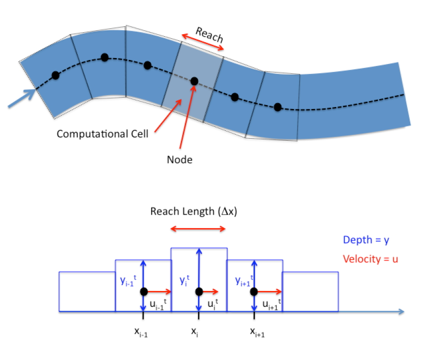

# CE 5362 Lesson 7 Unsteady Open Channel Flow
---

## Finite-Difference Method for Unsteady Open Channel Flow

Solving the St. Venant Equations is accomplished by mapping the physical system and the set of partial differential equations into an algebraic structure that a computer can  manipulate.   Finite-difference,  finite-element,  finite-volume,  and  marker-in-cell are the typical methods.  

The simplest form of solution that is conditionally stable and reasonably straightforward to program is called the Lax-Diffusion scheme.  This  scheme  is  reasonably  accurate  and  useful  for  practical  problems  as  well  as  to learn what goes on under the hood of a professional tool like SWMM or HEC-RAS.

## Governing Difference Equations -- Lax Scheme

The finite-difference analysis converts the two PDEs into an algebraic update struc-ture and maps boundary conditions onto a computational domain.  The two PDEs are continuity and momentum.  As a quick refresher:

The continuity equation for a computational cell (reach) is 
\begin{equation}
\frac{\partial y}{\partial t} = -\frac{A}{B}\frac{\partial V}{\partial x}-V\frac{\partial y}{\partial x}
\end{equation}

### Continunity
$A$ is the depth-area function (a function of x and y). 
$B$ is the depth-topwidth function (a function of x and y). 
The Lax scheme uses spatial averaging to represent the $A$, $B$, and $V$ terms that appear as coefficients on the partial derivatives on the right-hand side of the equation. 
The time derivative is accomplished with a conventional forward-in-time first order finite difference model, and the spatial derivatives are conventional first-order centered differences. Both these differencing schemes are prestented shortly.

### Momentum
The momentum equation is
\begin{equation}
\frac{\partial V}{\partial t} = g(S_0-S_f)-V\frac{\partial V}{\partial x}-g\frac{\partial y}{\partial x}
\end{equation}
and also uses spatial averages for the coefficients on the spatial derivatives in the right hand side of the equation as well as spatial averages for the friction and topographic slopes. 
Friction slope can be recovered using any resistance model, Chezy-Manning's is typical.

---

## Mapping from the Physical to Computational Domain

The next important step is to map the physical world to the computer world.


|Figure 1. Plan view of a stream.  Flow in figure is from left to right|
|:---|

Figure 1 is a schematic of a stream that is to be modeled. The stream has some width, depth, and path. 
The dashed line in the figure is the thalweg and is the pathline of the stream.  Distances in the computational model are along this path.  The conventional orientation is "looking downstream." So when the cross sections are stationed the distances in a cross section are usually referenced as distanced from the left bank, looking downstream.

Figure 2 is a schematic that depicts the relationship of left-bank, cross section, elevations, and such -- all referenced to the concept of "looking downstream."


|Figure 2. Schematic of relationship of cross-section, elevation, and left bank|
|:---|

Figure 3 is a schematic of the next step of mapping into the computational domain. 


|Figure 3. Schematic of physical interpretation of a reach, cell, and node|
|:---|

In the figure the stream is divided into cells called reaches (or cells, depends on context and author). The centroid of the reach is called the node, and most of the arithmetic is written with the understanding that all properties of the reach are somehow "averaged" and these averages are assigned to these nodes.  Adjacent nodes are connected (in the computer) by links (which represent conduits between nodes). The continuity and momentum equations collectively describe the node average behavior (such as depth) and link behavior (such as momentum flux).

Figure 4 is a schematic of three adjacent nodes that is used to develop the difference equations.



|Figure 4. Schematic of three adjacent nodes, with average depth and section velocity depicted at the node.|
|:---|

In the figure both the velocities and depths are mapped to the node (Lax-Diffusion scheme), but other schemes map the velocities to the interfaces. Again this decision affects the differencing scheme; the differencing scheme chooses the location. A kind of chicken and egg situation. 

At this point the mapping has **abstracted** considerably from the physical world and the computer world loses the sense of
sinuosity. In this development, we will assume the reach lengths are all the same value, the velocities are all parallel to the local thalweg and perpendicular to the cross sections, and the depth is measured from the channel bottom. The differencing scheme then replaces the continuity and momentum PDEs with update equations to map the water surface position and mean section velocity at the nodes to different moments in time. The updating is called time-stepping.

---
## Building the Difference Equations 
  
The partial derivatives are replaced with difference quotients that approximate their behavior.  
The mapping in some sense influences the resulting difference scheme. 

### Time Differences

A first-order time difference is 
\begin{equation}
\frac{\partial y}{\partial t}~\approx~\frac{y_i^{t+\Delta t}-y_i^t}{\Delta t}
\end{equation}
Lax replaced the known time-level term with its spatial average from adjacent cells.
For the depth;
\begin{equation}
\frac{\partial y}{\partial t}~\approx~\frac{y_i^{t+\Delta t}-\frac{1}{2}(y_{i-1}^t+y_{i+1}^t)}{\Delta t}
\end{equation}
Similarly for mean section velocity
\begin{equation}
\frac{\partial V}{\partial t}~\approx~\frac{V_i^{t+\Delta t}-\frac{1}{2}(V_{i-1}^t+V_{i+1}^t)}{\Delta t}
\end{equation}

### Space Differences  

Lax used centered differences for the spatial derivatives
\begin{equation}
\frac{\partial y}{\partial x}~\approx~\frac{y_{i+1}^{t}-y_{i-1}^t}{2\Delta x}
\end{equation}

\begin{equation}
\frac{\partial V}{\partial x}~\approx~\frac{V_{i+1}^{t}-V_{i-1}^t}{2\Delta x}
\end{equation}
Lax also used spatial averages for the depth-area and slope functions
\begin{equation}
\frac{1}{2}(\frac{A}{B}\vert_{i-1}^t + \frac{A}{B}\vert_{i+1}^t)
\end{equation}
\begin{equation}
\frac{1}{2}(S_{f,i-1}^t + S_{f,i+1}^t)
\end{equation}

These difference formulations are substituted into continunity and momentum and then rearranged to isolate the terms at the $t+\Delta t$ time level.

### Continunity  

Starting with the PDE,
\begin{equation}
\frac{\partial y}{\partial t} = -\frac{A}{B}\frac{\partial V}{\partial x}-V\frac{\partial y}{\partial x}
\end{equation}
first replace the time derivative
\begin{equation}
\frac{y_i^{t+\Delta t}-\frac{1}{2}(y_{i-1}^t+y_{i+1}^t}{\Delta t} = -\frac{A}{B}\frac{\partial V}{\partial x}-V\frac{\partial y}{\partial x}
\end{equation}
then replace the space derivatives
\begin{equation}
\frac{y_i^{t+\Delta t}-\frac{1}{2}(y_{i-1}^t+y_{i+1}^t}{\Delta t} = -\frac{A}{B}\frac{V_{i+1}^{t}-V_{i-1}^t}{2\Delta x}-V\frac{y_{i+1}^{t}-y_{i-1}^t}{2\Delta x}
\end{equation}
then the spatial averages for the remaining terms.
\begin{equation}
\begin{matrix}
\frac{y_i^{t+\Delta t}-\frac{1}{2}(y_{i-1}^t+y_{i+1}^t)}{\Delta t} = -\frac{1}{2}(\frac{A}{B}\vert_{i-1}^t + \frac{A}{B}\vert_{i+1}^t)\frac{V_{i+1}^{t}-V_{i-1}^t}{2\Delta x}-\frac{1}{2}(V_{f,i-1}^t + V_{f,i+1}^t)\frac{y_{i+1}^{t}-y_{i-1}^t}{2\Delta x}\\
~\\
 \end{matrix}
\end{equation}
Next multiply by $\Delta t$
\begin{equation}
\begin{matrix}
y_i^{t+\Delta t}-\frac{1}{2}(y_{i-1}^t+y_{i+1}^t) = -\Delta t\frac{1}{2}(\frac{A}{B}\vert_{i-1}^t + \frac{A}{B}\vert_{i+1}^t)\frac{V_{i+1}^{t}-V_{i-1}^t}{2\Delta x}-\Delta t \frac{1}{2}(V_{f,i-1}^t + V_{f,i+1}^t)\frac{y_{i+1}^{t}-y_{i-1}^t}{2\Delta x}\\
~\\
 \end{matrix}
\end{equation}
Move the time level $t$ term to the right hand side
\begin{equation}
\begin{matrix}
y_i^{t+\Delta t} = \frac{1}{2}(y_{i-1}^t+y_{i+1}^t) -\Delta t\frac{1}{2}(\frac{A}{B}\vert_{i-1}^t + \frac{A}{B}\vert_{i+1}^t)\frac{V_{i+1}^{t}-V_{i-1}^t}{2\Delta x}-\Delta t \frac{1}{2}(V_{f,i-1}^t + V_{f,i+1}^t)\frac{y_{i+1}^{t}-y_{i-1}^t}{2\Delta x}\\
~\\
 \end{matrix}
\end{equation}
Rename the constant  $\frac{\Delta t}{2 \Delta x} = r$ and simplify
\begin{equation}
\begin{matrix}
y_i^{t+\Delta t} = \frac{1}{2}(y_{i-1}^t+y_{i+1}^t) -\frac{r}{2}(\frac{A}{B}\vert_{i-1}^t + \frac{A}{B}\vert_{i+1}^t)(V_{i+1}^{t}-V_{i-1}^t)-\frac{r}{2}(V_{f,i-1}^t + V_{f,i+1}^t)(y_{i+1}^{t}-y_{i-1}^t) \\
~\\
 \end{matrix}
 \label{eqn:lax-continunity}
\end{equation}

### Momentum 

Again, starting with the PDE, make the time substitution
\begin{equation}
\frac{V_i^{t+\Delta t}-\frac{1}{2}(V_{i-1}^t+V_{i+1}^t)}{\Delta t} = g(S_0-S_f)-V\frac{\partial V}{\partial x}-g\frac{\partial y}{\partial x}
\end{equation}
next the space derivatives
\begin{equation}
\begin{matrix}
\frac{V_i^{t+\Delta t}-\frac{1}{2}(V_{i-1}^t+V_{i+1}^t)}{\Delta t} = g(S_0-S_f)-V\frac{V_{i+1}^{t}-V_{i-1}^t}{2\Delta x}-g\frac{y_{i+1}^{t}-y_{i-1}^t}{2\Delta x}\\
~\\
\end{matrix}
\end{equation}
then the spatial averages (If the channel slope is changing, then this would be subjected to a spatial averaging scheme too!)

\begin{equation}
\begin{matrix}
\frac{V_i^{t+\Delta t}-\frac{1}{2}(V_{i-1}^t+V_{i+1}^t)}{\Delta t} = 
g(S_0-\frac{1}{2}(S_{f,i-1}^t + S_{f,i+1}^t))
-\frac{1}{2}(V_{i-1}^t+V_{i+1}^t) \frac{V_{i+1}^{t}-V_{i-1}^t}{2\Delta x}
-g\frac{y_{i+1}^{t}-y_{i-1}^t}{2\Delta x}\\
~\\
\end{matrix}
\end{equation}
Multiply by $\Delta t$
\begin{equation}
\begin{matrix}
V_i^{t+\Delta t}-\frac{1}{2}(V_{i-1}^t+V_{i+1}^t)= 
\Delta t  g(S_0-\frac{1}{2}(S_{f,i-1}^t + S_{f,i+1}^t))
-\Delta t  \frac{1}{2}(V_{i-1}^t+V_{i+1}^t) \frac{V_{i+1}^{t}-V_{i-1}^t}{2\Delta x}
-\Delta t  g\frac{y_{i+1}^{t}-y_{i-1}^t}{2\Delta x}\\
~\\
\end{matrix}
\end{equation}

Rename the constant  $\frac{\Delta t}{2 \Delta x} = r$ and isolate the $t + \Delta t$ term

\begin{equation}
\begin{matrix}
V_i^{t+\Delta t}=\frac{1}{2}(V_{i-1}^t+V_{i+1}^t) +
\Delta t  g(S_0-\frac{1}{2}(S_{f,i-1}^t + S_{f,i+1}^t))
- \frac{r}{2}(V_{i-1}^t+V_{i+1}^t) (V_{i+1}^{t}-V_{i-1}^t)
-rg(y_{i+1}^{t}-y_{i-1}^t)\\
~\\
\end{matrix}
\label{eqn:lax-momentum}
\end{equation}

The pair of update equations are the interior point update equations.

Figure 5 depicts the updating information transfer. 

At each cell the three known values of a variable ($y$ or $V$) are projected to the next time line as depicted in the figure.

Boundary conditions are the next challenge. These are usually handled using a characteristic equation approach (unless the boundaries are really simple).  For the time being we will use pretty simple boundary conditions, and complicate as necessary.

 

|Figure 5. Relation of the linked reaches to solution of the equations in the XT-plane. Explicit updating (as used herein) uses the three values at the known time level to project (update) the unknown value at the next time level. Boundary behavior is a separate calculation, dependent on the evolution of the interior solution|
|:---|


## Example 1: Steady Flow over a Weir

The backwater curve situation for a rectangular channel with discharge over a weir is repeated.  
The channel width is 5 meters, bottom slope $0.001$, Manning's $n=0.02$ and discharge $Q=55.4 \frac{m^3}{sec}$.
We will start with the flow depth artificially large and observe that the transient solver will eventually produce an *equilibrium* solution that is more or less the same as the steady-flow solver.  

Generally such a simulation is a good idea to test a new algorithm -- it should be stable enough to converge to and maintain a steady solution.

A script that implements these concepts is the subject of our next workshop, as before we will also perform the computations in SWMM.

---
## References

Koutitas, C. G. 1983. Elements of Computational Hydraulics. ISBN 0-412-00361-9. Pentech Press Ltd. London. (Chapter 4) [http://54.243.252.9/ce-5362-psuedo-course/3-Readings/PracticalComputationalHydraulics-Kousitas/ElementsOfComputationalHydraulics.pdf](http://54.243.252.9/ce-5362-psuedo-course/3-Readings/PracticalComputationalHydraulics-Kousitas/ElementsOfComputationalHydraulics.pdf)

Roberson, J. A., Cassidy, J.J., and Chaudry, M. H., (1988) Hydraulic Engineering, Houghton Mifflin Co (Chapter 10) [http://54.243.252.9/ce-5362-psuedo-course/3-Readings/HydraulicEngineering/](http://54.243.252.9/ce-5362-psuedo-course/3-Readings/HydraulicEngineering/)

Sturm T.W (2001) Open Channel Hydraulics, 1ed., McGraw-Hill, New York. Note: This PDF is from an international edition published in Singapore. [http://54.243.252.9/ce-5362-psuedo-course/3-Readings/OpenChannelHYdraulics/](http://54.243.252.9/ce-5362-psuedo-course/3-Readings/OpenChannelHYdraulics/)


```python

```
